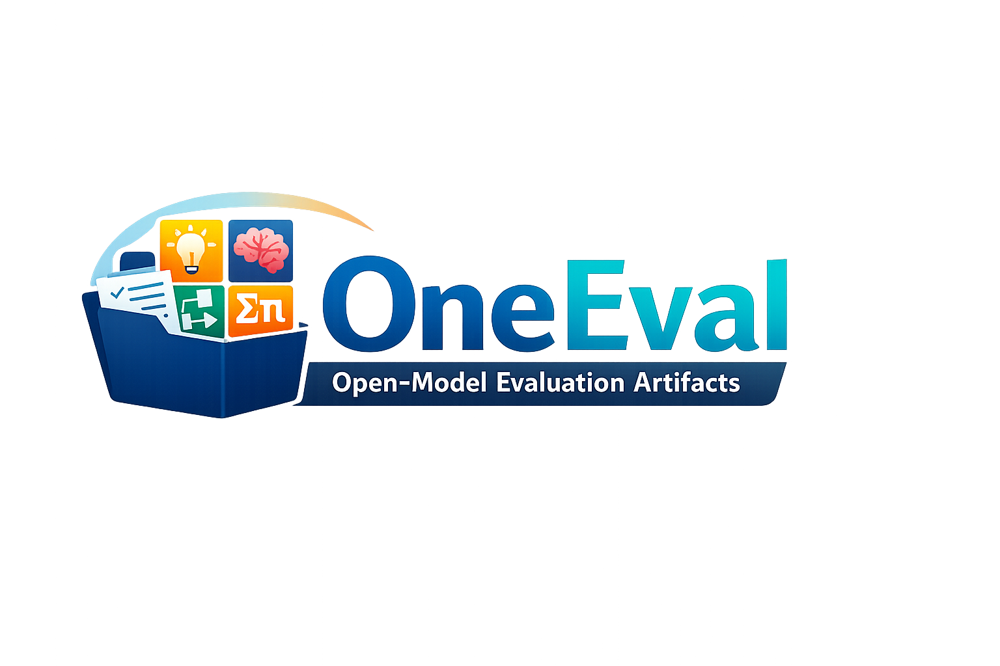

<p align="center">
  
</p>

<p align="center">
  <a href="mailto:chenxuan026@icloud.com">Xuan Chen</a>
  ·
  <a href="mailto:482501090@qq.com">Qiuxuan Chen</a>
  ·
  <a href="mailto:mjv1cp@gmail.com">Bo Liu</a>
</p>

<p align="center">
  <a href="https://XChen-Zero.github.io/OneEval/">🌐 Website</a>
  &nbsp;|&nbsp;
  <a href="https://github.com/XChen-Zero/OneEval/">💻 Code</a>
  &nbsp;|&nbsp;
  <a href="published_results/">📦 Results</a>
  &nbsp;|&nbsp;
  <a href="README.zh-CN.md">🇨🇳 中文</a>
</p>

## Motivation

Open LLM evaluation results are frequently hard to audit and difficult to reproduce. Two recurring gaps appear across benchmark reports and evaluation framework issue threads:

- the exact evaluation protocol (sampling knobs, run repetitions, and runtime assumptions) is often underspecified
- rich benchmarks are commonly reduced to headline aggregates, obscuring subset-level behavior (e.g., MMLU-Pro domains) or multi-sample behavior (e.g., pass@k curves)

OneEval addresses these gaps by publishing the evidence needed for inspection: the launch code used for the suite, a sanitized protocol summary, and the detailed result slices that explain how an overall number is composed.

## Scope

This repository is not a leaderboard and does not publish a composite score. The emphasis is on artifact release and auditability rather than ranking.

## What Is Released

- [site/](site/): the static website (GitHub Pages), organized by benchmark type
- [published_results/](published_results/): the public result tree, organized as `models/<model>/<benchmark>/<mode>/<run_id>/`
- [site/data/](site/data/): site-side data bundles, derived from the public results
- [evaluation_code/](evaluation_code/): launch scripts and targeted monkey patches used for the runs

## Reading Guide (Website)

The website organizes benchmarks into four reading tracks with benchmark-specific views:

- Knowledge
- Agentic
- IF (Instruction Following)
- Reasoning

The tables prioritize academic readability:

- QA-style benchmarks expose `Correct / Incorrect / Abstain` explicitly
- subset-heavy benchmarks use an overall table with subset drilldowns
- pass@k benchmarks provide milestone summaries (k=1/8/32/64) and an interactive curve view

## Benchmarks In This Release

Current benchmark set (as published in the site data):

- Knowledge: `chinese_simpleqa`, `gpqa_diamond`, `mmlu_pro`, `simple_qa`, `super_gpqa`
- Agentic: `bfcl_v3`
- IF: `ifeval`
- Reasoning: `aime24`, `aime25`, `hmmt25`, `zebralogicbench`

## Evaluation Stack

The evaluation stack used for the published artifacts:

- EvalScope: `1.4.1`
- BFCL Eval: `2026.2.9`
- Qwen3 series and Llama family local serving: `sglang 0.5.6`
- Qwen3 series and Llama family agent tooling: `qwen_agent 0.0.31`
- Qwen3.5 series inference path: DashScope-compatible API
- Qwen3.5 series agent tooling: `qwen_agent 0.0.34`

Operational notes (as reflected in the published protocol summary on the site):

- Qwen3 family models, including DeepSeek-R1-Qwen3 variants, are evaluated under the unified sampling protocol documented in the site.
- Llama-family runs use fixed single-repeat settings where the sampling configuration is deterministic.
- BFCL v3 agentic evaluation uses a YaRN-extended context setup to `131072` where applicable.

## Notes On Use

This repository ships a materialized public release (`published_results/` and `site/data/`). The public repository is intended for inspection, browsing, and reuse of the released artifacts.

To preview the site locally:

```bash
.venv/bin/python -m http.server 8000
```

Then open `http://localhost:8000/site/`.


## Citation

If you use OneEval in a report or derivative analysis, please cite the repository:


```bibtex
@misc{oneeval,
  title        = {OneEval: Open-model evaluation artifacts},
  author       = {Chen, Xuan and Chen, Qiuxuan and Liu, Bo},
  year         = {2026},
  howpublished = {GitHub repository},
  note         = {Accessed: 2026-03-03},
  url          = {https://github.com/XChen-Zero/OneEval/}
}
```
